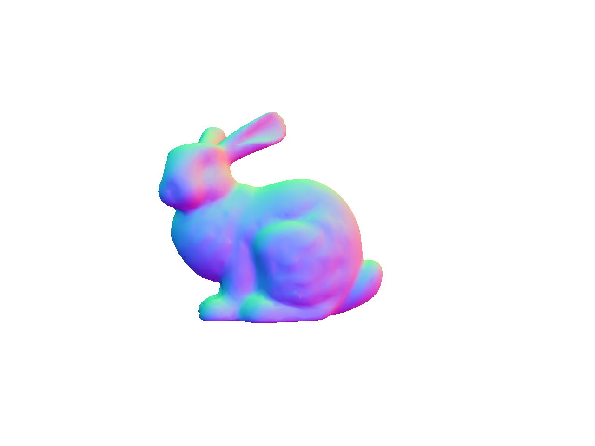
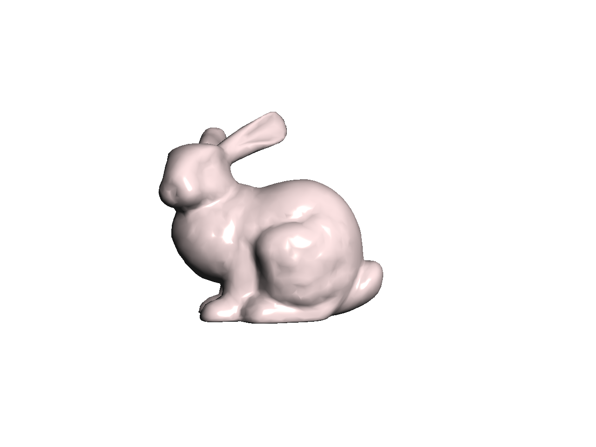
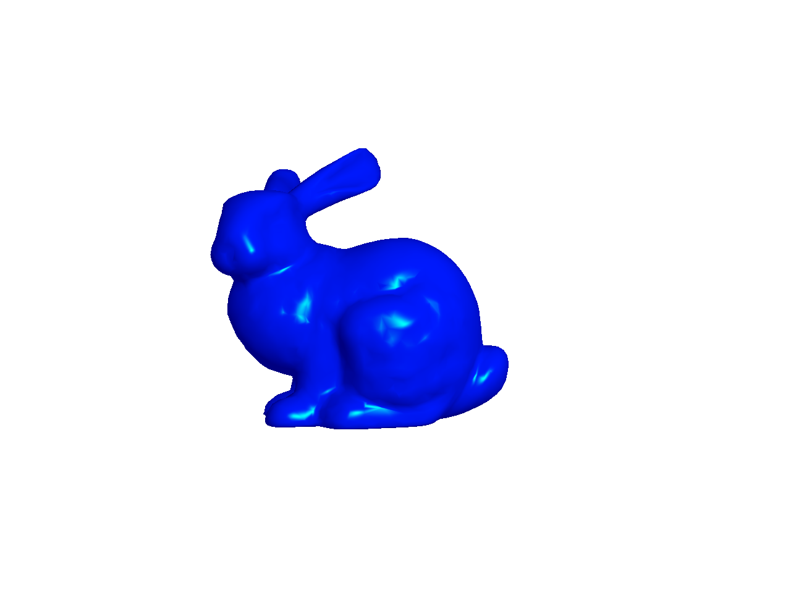
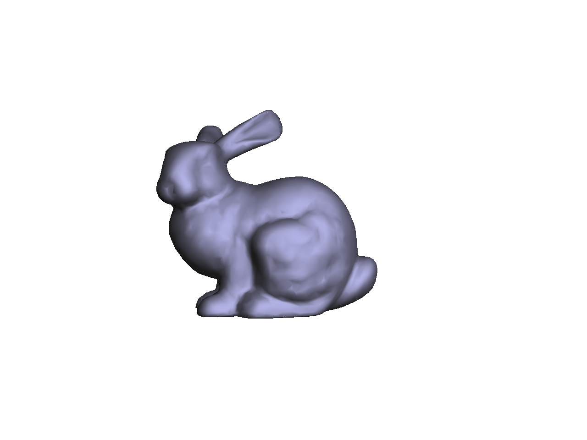
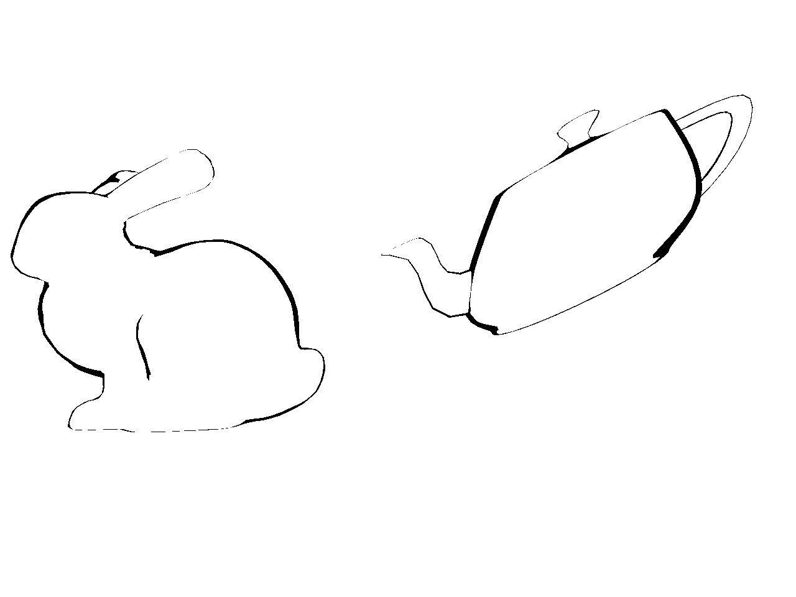
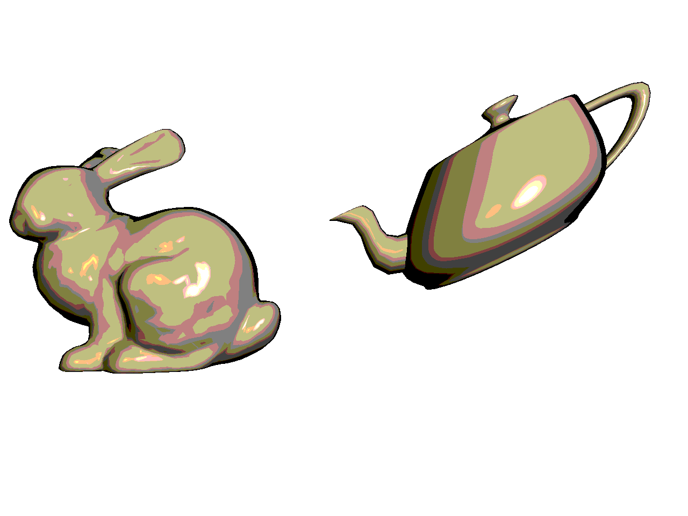

# Multi Shaders

## Demo
https://github.com/BlakeAveryTAMU/Multi-Shaders/assets/108947178/141a11f8-b00f-4b8e-9e55-2b7b1671fd55

## Description

This program uses OpenGL, GLSL, and C++ code to implement different shading models. There are a total of 4 different shading models that are used: normal coloring, Blinn-Phong shading, silhouette shading, and cel shading. To cycle through the different shaders, use the `s/S` keys. There are also 2 different lights with varying positions and colors which can be moved around the scene as the program is running. Use `l/L` to cycle through the lights and `x/X` and `y/Y` to move the lights in the positive and negative x/y directions. When using the Blinn-Phong and cel shader, press `m/M` to cycle through 3 different materials. Pressing `spacebar` will cause the bunny to rotate with time and the teapot to shear with time. 

## Normal Coloring

## Blinn-Phong

## Silhouette Shader

## Cel Shader

